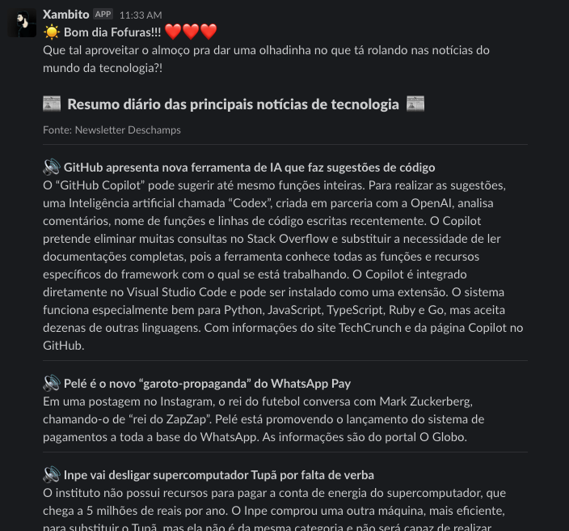

# Slack Bot com as notícias do Deschamps
Bot para Slack que publica a Newsletter do Deschamps recebida no Gmail  



## Instalação da Biblioteca
- Python 3.8+

```bash
pip install slackbot-newsletter-deschamps
```

## Cadastro Newsletter
- Por questão de segurança, sugiro que crie um e-mail só pra receber a newsletter.  
    - Pra garantir compatibilidade utilize o Gmail.      
- Configure seu a autenticação de 2 fatores e habilite o acesso por senha de aplicativo.  
    - https://support.google.com/accounts/answer/185833?hl=pt  

- Faça seu cadastro na Newsletter: 
    - https://newsletter.filipedeschamps.com.br/  

## Crie um bot de slack
- https://slack.com/intl/pt-br/help/articles/115005265703-Criar-um-bot-para-o-workspace  
- https://www.youtube.com/watch?v=KJ5bFv-IRFM

## Código de Exemplo
```bash
from newsletter import Newsletter

newsletter = Newsletter('email@email.com', 'password_do_email','token_slack','#canal_do_slack')
newsletter.publish()

```
Vc pode modificar título/ subtítulo, configurações do e-mail, ou adicionar e remover linhas do texto convertido que vem do e-mail através de parâmetros:  
```bash
from newsletter import Newsletter

newsletter = Newsletter('email@email.com', 'password_do_email','token_slack','#canal_do_slack') 
newsletter.startline_from_top = 4 # As 4 primeiras linhas do texto capturado do e-mail são removidas
newsletter.endline_from_bottom = -5 # As 5 últimas linhas do texto capturado do e-mail são removidas
newsletter.host = 'imap.gmail.com'
newsletter.port = 993
newsletter.mrkdown_title = ":sunny: *Bom dia Fofuras!!!* :heart::heart::heart:\n Que tal aproveitar o almoço pra dar uma olhadinha no que tá rolando nas notícias do mundo da tecnologia?!"
newsletter.mrkdown_subtitle = ":newspaper:  Resumo diário das principais notícias de tecnologia  :newspaper:"

newsletter.publish()

```

## No Slack
- Para funcionar mencione o nome do bot usando @
- Convide o bot pra sala

## Automação da chamada do script
- É interessante que o script execute automaticamente 1 vez por dia por volta das 11:30  

### Function Lambda
- Sugiro utilizar uma função Serverless, como o Lambda da AWS
    - Desta forma vc consegue fazer totalmente sem custos
    - https://docs.aws.amazon.com/pt_br/lambda/latest/dg/lambda-python.html
- Pra incluir a biblioteca numa função lambda:
    - https://docs.aws.amazon.com/pt_br/lambda/latest/dg/python-package.html

### Uso na máquina Local
- Não aconselho, mas se quiser usar na máquina local...
- Crie um Crontab no seu sistema operacional pra chamar o script 1 vez por dia

- **Exemplo pra Mac OS** (mas é bem fácil de achar no google pra outros sistemas):
    - https://www.jcchouinard.com/python-automation-with-cron-on-mac/

- No meu caso, configurei pra todos os dias da semana as 11:30
    - Modelo pra Crontab: [https://crontab.guru/#30_11_*_*_1-5](https://crontab.guru/#30_11_*_*_1-5)

## Inspiração pra ideia
- https://newsletter.filipedeschamps.com.br/  
- https://www.youtube.com/watch?v=wm82gDsKN0E
